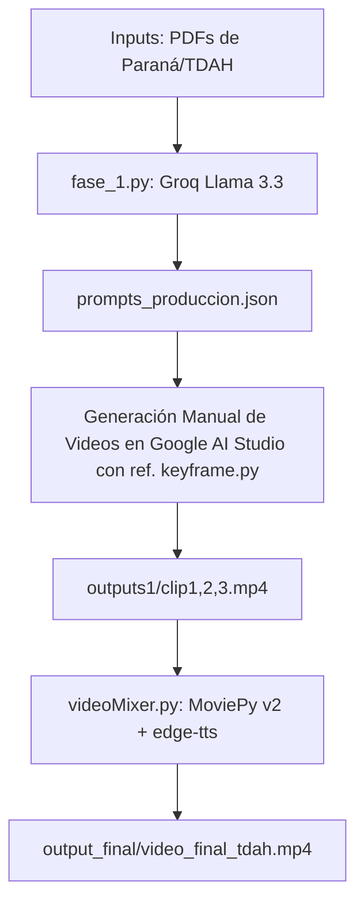

# INFORME TRABAJO PRÁCTICO IHM: LLAMAR LA ATENCIÓN AL USUARIO
## Diseño de un Mínimo Viable para un Video Breve a partir de un PDF Conceptual
### Caso de Estudio: Solución Digital "UniPase" para Estudiantes con TDAH

**Cátedra:** Interfaz Hombre-Máquina (IHM)  
**Docentes:** Mg. Díaz, Santiago R. | BioIng. Hadad, A.  

---

## Parte A. Introducción

### 1. ¿Qué es el TDAH?
El Trastorno por Déficit de Atención con Hiperactividad (TDAH) es un trastorno del neurodesarrollo de base biológica y hereditaria, caracterizado por patrones persistentes de inatención, hiperactividad e impulsividad. A nivel neurobiológico, se asocia principalmente con una desregulación en la transmisión de neurotransmisores en la corteza prefrontal, especialmente la **dopamina** y la **noradrenalina**. Esta alteración afecta de manera directa a las funciones ejecutivas, tales como la memoria de trabajo, la inhibición de respuestas, la regulación de las emociones y la capacidad de planificación y automonitoreo. En adultos y jóvenes universitarios, el TDAH no se manifiesta necesariamente como hiperactividad motora (correr o trepar), sino como inquietud interna, fatiga cognitiva rápida, baja tolerancia a la frustración y una marcada propensión a la distracción ante estímulos ambientales irrelevantes pero salientes.

### 2. Relevancia para la Interfaz Hombre-Máquina (IHM)
Desde la perspectiva del diseño de interfaces y la ingeniería de producto digital, el TDAH es un caso de estudio crítico. Las interfaces tradicionales asumen un usuario con una atención sostenida estable y una capacidad de procesamiento lineal. Para un usuario con TDAH, cualquier fricción, ambigüedad visual o sobrecarga de información actúa como un "disparador de abandono". 
Diseñar para el TDAH exige que la interfaz:
*   Reduzca la **carga cognitiva** al mínimo indispensable.
*   Dirija la **atención selectiva** mediante elementos visuales altamente contrastantes y jerarquizados.
*   Administre los ciclos de **motivación y recompensa** mediante retroalimentación inmediata, contrarrestando la tendencia a la búsqueda de estímulos distractores y la aversión a la espera.

### 3. Llamar la atención del usuario como problema de diseño
En el ecosistema de consumo digital contemporáneo, la atención es el recurso más escaso y disputado. Una pieza audiovisual o una interfaz no compiten en el vacío: compiten contra notificaciones push, ruidos externos, pensamientos intrusivos y el hábito del "scroll infinito". Llamar y sostener la atención de manera ética —sin caer en patrones oscuros o manipulación— es un desafío técnico-psicológico. Requiere diseñar **saliencia visual** (hacer que lo importante destaque físicamente por color, tamaño, forma o movimiento), aplicar **contraste figura-fondo** estricto para guiar la lectura, y estructurar el flujo temporal (ritmo de edición) de modo que mantenga el interés sin saturar la **memoria de trabajo** del usuario.

---

## Parte B. Análisis del PDF Conceptual

### 1. Resumen del Documento Conceptual (`UniPase.pdf`)
El documento describe el lanzamiento oficial de **UniPase**, un programa estratégico impulsado por la Municipalidad de Paraná en conjunto con la Mesa Interuniversitaria (Marca Paraná). UniPase consiste en una tarjeta de beneficios exclusivos orientada a la población estudiantil universitaria de la ciudad de Paraná (que cuenta con más de 60.000 estudiantes distribuidos en cuatro universidades nacionales e institutos superiores). El programa busca facilitar el acceso a descuentos, articular al sector público-privado con la academia, promover la identidad de Paraná como polo educativo regional y aliviar los costos diarios asociados a la vida estudiantil.

### 2. Concepto Principal
El concepto central de UniPase es la **vinculación y facilitación de la vida universitaria**. La tarjeta actúa como un puente unificado que reduce la fricción económica y administrativa del estudiante, integrando múltiples beneficios en una sola credencial (física o digital).

### 3. Mensaje a Comunicar en el Video
El mensaje central es: **"UniPase unifica tus beneficios de transporte y comercio estudiantil en Paraná en un solo paso, eliminando la frustración y devolviéndote el control."**

---

## Parte C. Diseño del Video

### 1. Público Objetivo
Estudiantes universitarios de Paraná, de entre 18 y 25 años, con alta exposición a redes sociales, distractibilidad elevada (TDAH e inatención general) y cansancio debido a la rutina de estudio y movilidad urbana.

### 2. Objetivo del Video
Captar la atención selectiva del estudiante en menos de 2 segundos, visibilizar la frustración común de la movilidad urbana/costos, y presentar a UniPase como la solución inmediata y de baja fricción que restaura su equilibrio dopaminérgico.

### 3. Hook Principal
*   **Texto en pantalla (0-4s):** "¿Varado y sin tiempo?"
*   **Estímulo Visual:** Un plano detalle del protagonista mirando con angustia su billetera vacía mientras el colectivo de Paraná se aleja en el fondo. El quiebre de expectativa y el alto contraste emocional detienen el scroll del usuario.

### 4. Storyboard y Curva Dopaminérgica

El video está estructurado en 3 fases narrativas de exactamente 4 segundos cada una (Duración Total: 12 segundos, cumpliendo estrictamente con la ventana de 8-15 segundos exigida por el enunciado):

| Tiempo | Fase Narrativa / Psicológica | Descripción Visual (Scene Bible integrada) | Subtítulo de Saliencia (Español) | Justificación de IHM / TDAH |
| :--- | :--- | :--- | :--- | :--- |
| **0 - 4s** | **Punción de Muerte (PM)** | Plano medio de un joven de 20 años en una parada de colectivo en Paraná. Expresión de frustración extrema al ver pasar el transporte. Luz dura. Estilo cinematográfico 9:16 vertical. | `¿Varado y sin tiempo?` | **Hook Emocional y Contraste**. Conecta de inmediato con el dolor del usuario. El texto corto en caja de alto contraste evita la fatiga de lectura inicial. |
| **4 - 8s** | **Bloque Neutro (N)** | Transición visual. El personaje saca su celular con calma y abre la aplicación. El fondo se desenfoca. Luz suave y calma. | `Hay una mejor opción...` | **Switch Dopaminérgico**. Disminuye la dopamina negativa (frustración). Introduce un momento de transición visual simple que reorienta la atención hacia el dispositivo. |
| **8 - 12s** | **Punción de Vida (PV)** | El joven sonríe con alivio mientras la pantalla del teléfono muestra la tarjeta digital UniPase. En el fondo, un colectivo se detiene y él sube confiado. | `¡Viajá simple con UniPase!` | **Recompensa Inmediata**. Ofrece el alivio del problema. Cierre con la idea fuerza que estimula la memoria de trabajo y fija el nombre de la solución. |

### 5. Estilo Visual y Consistencia
*   **Formato:** Vertical (9:16), 1080x1920 píxeles, 24 FPS.
*   **Paleta de Colores:** Tonos fríos y contrastantes (azules y grises) en la fase PM para evocar tensión; transicionando a tonos cálidos y luminosos en la fase PV para evocar alivio.
*   **Tipografía y Caja de Texto:** Arial Bold, tamaño 42, color blanco sobre caja de fondo negro con 70% de opacidad (RGBA: `0,0,0,180`). Esto garantiza la máxima **legibilidad** y contraste figura-fondo, permitiendo que personas con dificultades de procesamiento visual (inatención) lean el texto de un vistazo sin esfuerzo cognitivo.

### 6. Diseño del Audio
*   **Locución (Voz en off):** Voz sintética de tonalidad clara, pausada y empática generada con redes neuronales (`es-MX-DaliaNeural`). La locución recita estrictamente los subtítulos dinámicos de pantalla en sincronía para evitar la redundancia dispersiva (según el principio de modalidad en psicología cognitiva, la información visual y auditiva debe complementarse, no competir).
*   **Estructura del Audio:** Sin música estridente que provoque fatiga sensorial o enmascare la voz en off.

---

## Parte D. Ingeniería por Fases y Arquitectura Técnica

El proyecto implementa un pipeline automatizado y modular codificado en Python que divide el proceso de producción de video en fases lógicas e independientes para mitigar la inestabilidad de las IAs generativas de video.

### 1. Fase 1: Extracción Documental e Ingesta Semántica
El script `fase_1.py` lee automáticamente los PDFs ubicados en la carpeta `/inputs` utilizando la librería `pdfplumber`. Consolida el texto y realiza un recorte seguro de los primeros caracteres para evitar desbordamientos de contexto del LLM.

### 2. Fases 2, 3 y 4: Planificación, Síntesis y Storyboard
Utilizando Groq Cloud con el modelo de lenguaje `llama-3.3-70b-versatile` (con temperatura baja de `0.2` para garantizar precisión estructural), el sistema analiza la base cognitiva del TDAH y el documento de beneficios `UniPase.pdf`. Sintetiza y produce de forma atómica:
*   La **Idea Fuerza Comunicacional**.
*   La **Scene Bible** (Contrato visual estable en inglés técnico para el personaje, ropa y ambiente).
*   El **Shot List de 12 segundos** (3 segmentos de 4 segundos) con los prompts en inglés para la generación de video y sus correspondientes subtítulos dinámicos en español de alta saliencia.
Los datos resultantes se persisten en `prompts_produccion.json`.

### 3. Fase 5: Consolidación de Prompts
Los prompts resultantes se organizan directamente en el archivo estructurado `prompts_produccion.json`. El usuario puede leer este JSON para copiar y pegar de forma ágil la Scene Bible y los prompts de acción correspondientes a cada clip en la interfaz generativa.

### 4. Fase 6: Generación de Video y Mantenimiento de Consistencia
Se generan tres clips de 4 segundos (`clip1.mp4`, `clip2.mp4` y `clip3.mp4`). Para garantizar la **consistencia visual** de forma eficiente:
*   **Enfoque de Consistencia Nativa en Google Flow**: En lugar de saturar el cuadro de texto de la IA con la Scene Bible completa (lo que genera *prompt bloat* y eleva el riesgo de que la IA ignore la acción física), la mejor práctica de IHM es **configurar el personaje estable de manera nativa** mediante el Constructor de Personajes (Character Builder / Persona Reference) de Google Flow. 
*   **Prompt de Acción Pura**: Una vez configurado el personaje visual, el prompt copiado de `prompts_produccion.json` se simplifica a la acción pura en inglés (ej. *"The young male student is standing at the bus stop, looking frustrated and checking his empty wallet, as the bus drives away without him, with a blurred background"*). Esto reduce significativamente la fricción del usuario al interactuar con la consola de comandos de la IA.
*   **Control de Continuidad**: Si el sistema requiere forzar continuidad espacial estricta (ej. entre el clip 1 y el 2), el script `keyframe.py` extrae automáticamente el último frame del clip anterior usando OpenCV (`cv2.VideoCapture`) y se sube como imagen guía (Image-to-Video) en la web de Flow para la siguiente escena.

### 5. Fase 7: Audio, Subtítulos Dinámicos y Visual Pacing (`videoMixer.py`)
El script `videoMixer.py` realiza la postproducción programática adaptada paraMoviePy v2:
*   **Locución Sintética:** Genera el audio `audio_narracion.mp3` invocando de forma asíncrona la API de `edge-tts`.
*   **Subtítulos de Alta Saliencia Segmentados:** En lugar de inyectar un texto largo estático, el script mide la duración de cada clip de video y superpone un `TextClip` independiente para cada escena (0-4s, 4-8s, 8-12s) en la base inferior. Se configura una caja de texto semi-transparente para maximizar el contraste figura-fondo.
*   **Visual Pacing (Barra de Progreso Dinámica):** Mediante un filtro de cuadro a nivel de pixel (`clip.fl`), el script dibuja cuadro por cuadro una barra amarilla brillante (`RGB: [255, 223, 0]`) en la base inferior del video. Esta barra crece de izquierda a derecha de forma proporcional al tiempo del video ($t / \text{duración total}$). Esto proporciona un indicador atencional analógico fundamental para que el usuario con TDAH mantenga el foco y procese la secuencia temporal del reel.

---

## Parte E. Conclusión

### 1. Ventajas del Enfoque por Fases (Pipeline Modular)
*   **Control de la Aleatoriedad:** La generación de videos por IA a partir de un solo prompt largo suele desviar el argumento y fundir conceptos. Al segmentar la lógica en tres clips acotados y orquestados, mantenemos el control preciso sobre el guion gráfico y la curva dopaminérgica del TDAH.
*   **Eficiencia de Recursos:** Si el clip final presenta un error en la generación, solo es necesario regenerar ese fragmento de 4 segundos y re-ensamblar, en lugar de renderizar un video completo de 12 segundos desde cero, reduciendo drásticamente el consumo de recursos de cómputo y tokens.
*   **Garantía de Contraste y Accesibilidad (IHM):** La postproducción programática asegura que las reglas de accesibilidad (tamaño de fuente, contraste figura-fondo, subtítulos no redundantes y visual pacing) se apliquen de forma consistente, sin depender de los textos deformados o fallidos generados de forma nativa por las IAs de video.

### 2. Riesgos de Utilizar un Solo Prompt (Enfoque Monolítico)
*   **Alucinación Visual:** El motor de video mezcla los tres momentos narrativos (caos, calma y resolución) en una misma secuencia, provocando deformaciones de personajes, cambios de ropa repentinos (falta de consistencia física) y saturación cromática.
*   **Pérdida del Target de Saliencia:** Es imposible coordinar con precisión milimétrica la aparición de subtítulos y el ritmo de la locución si el video resultante tiene una duración impredecible y no segmentada.

### 3. Mejoras Futuras en Códigos
*   **Sincronización Labial Automatizada (Wav2Lip):** Integrar un modelo de Lip-Sync para que los movimientos labiales del personaje en la fase final (PV) coincidan con la locución de la voz sintética.
