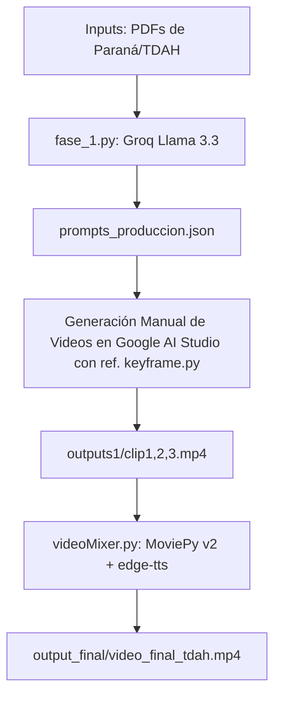

# Pipeline de Generación de Video Vertical Saliente para TDAH (UniPase)
[](https://www.python.org/)
[](https://zulko.github.io/moviepy/)
[-green.svg)](https://groq.com/)
[](https://opensource.org/licenses/MIT)
Este repositorio contiene el pipeline automatizado y modular desarrollado para la cátedra de **Interfaz Hombre-Máquina (IHM)**. Su objetivo es la creación de piezas audiovisuales en formato vertical (reels/shorts de 9:16) optimizadas específicamente para estudiantes universitarios con **Trastorno por Déficit de Atención con Hiperactividad (TDAH)**, promoviendo los beneficios de la credencial digital **UniPase**.
---
## 🧠 Fundamentos de Diseño IHM para TDAH
El TDAH afecta las funciones ejecutivas, disminuyendo la atención sostenida y aumentando la fatiga cognitiva frente a estímulos sobrecargados o monótonos. Este pipeline integra reglas de diseño de interfaz de alta saliencia basadas en neurociencia cognitiva:
1. **Curva Dopaminérgica Estricta (12 Segundos)**: El video está compuesto por tres clips de **exactamente 4.0 segundos** cada uno. El ritmo dinámico y predecible mantiene enganchado al espectador sin saturarlo.
2. **Visual Pacing (Barra de Progreso Dinámica)**: Se dibuja cuadro por cuadro una barra amarilla brillante (`RGB: [255, 223, 0]`) en la base inferior que avanza proporcionalmente al tiempo ($t / \text{duración}$). Funciona como ancla atencional analógica para estimar visualmente la duración restante.
3. **Contraste Figura-Fondo y Caja con Padding**: Los subtítulos se sitúan en la zona inferior-media (`h - 320`) para no interferir con la barra de progreso. Se renderizan sobre una caja negra semi-transparente (`opacity: 0.7`) con un **padding seguro de 40px en horizontal y 20px en vertical** para asegurar que letras con trazos descendentes (como *y, p, g, j*) o tildes nunca se recorten.
4. **Locución y Subtítulos Simétricos (Audio de Saliencia)**: La locución en off lee **exactamente las mismas palabras** que figuran en pantalla, evitando la distracción por redundancia disonante.
---
## 🎬 Estructura Narrativa Dinámica
El pipeline procesa los PDFs de base regulatoria y científica y genera una narrativa segmentada según la curva de tensión atencional del TDAH:
|
 Bloque 
|
 Tiempo 
|
 Fase Narrativa / Psicológica 
|
 Función IHM / TDAH 
|
|
:---
|
:---
|
:---
|
:---
|
|
**
Clip 1
**
|
`0.0s - 4.0s`
|
**
Punción de Muerte (PM)
**
|
**
Hook de tensión
**
: Presentación del conflicto o frustración inicial del estudiante en Paraná (ej. 
*
¿Acaso pierdes el colectivo por falta de saldo?
*
). 
|
|
**
Clip 2
**
|
`4.0s - 8.0s`
|
**
Bloque Neutro (N)
**
|
**
Switch mental y calma
**
: Transición e inicio de la búsqueda de la solución digital (ej. 
*
Encuentra la solución digital y viaja sin preocupaciones
*
). 
|
|
**
Clip 3
**
|
`8.0s - 12.0s`
|
**
Punción de Vida (PV)
**
|
**
Recompensa final
**
: Resolución exitosa y alivio dopaminérgico gracias al uso de UniPase (ej. 
*
¡Sube al colectivo y viaja seguro con UniPase!
*
). 
|
---
## 🛠️ Arquitectura del Pipeline
El proyecto está diseñado bajo un modelo híbrido: la generación narrativa y la postproducción de video se automatizan con Python, mientras que la generación visual del video se realiza de forma manual en IAs generativas de video como Google Flow / Vids para garantizar calidad artística.

### Descripción de Módulos:
*   **`fase_1.py` (Ingesta y Planificación)**:
    *   Lee automáticamente los documentos PDF en `/inputs` (usando `pdfplumber`).
    *   Pregunta en consola al usuario por una "idea creativa" o consigna.
    *   Consulta a Llama 3.3 en Groq Cloud para estructurar la idea en las 3 punciones.
    *   **Blindaje de Collage en Google Flow**: Genera una **Scene Bible** en inglés estrictamente estática y física. Los estados de ánimo cambiantes se asignan **únicamente a los prompts individuales de cada clip**, evitando que los motores de generación de imagen dividan el canvas en collages de 4 cuadrantes.
    *   Guarda la estructura en `prompts_produccion.json`.
*   **`keyframe.py` (Gestor de Continuidad)**:
    *   Extrae el último frame de un clip de video usando OpenCV (`cv2.VideoCapture`) para ser utilizado como imagen guía (Image-to-Video) en la generación de la siguiente toma, manteniendo la consistencia de raccord.
*   **`videoMixer.py` (Ensamblador y Postproducción)**:
    *   Inicia de forma paralela la síntesis de voz usando `edge-tts` (voz: `es-MX-DaliaNeural`).
    *   Fuerza los clips de video en `outputs1/` a exactamente 4.0 segundos cada uno.
    *   Mezcla las voces con las pistas de música de ambiente (`audios/muerte.mp3`, `audios/neutro.mp3`, `audios/vida.mp3`) reducidas al **30% de volumen** mediante `CompositeAudioClip`.
    *   Posiciona los subtítulos dentro de sus cajas de color con padding.
    *   Transforma el video inyectando la barra de progreso de alta saliencia.
    *   Cierra todos los descriptores de archivos para evitar fallos de memoria o bloqueos en Windows.
---
## 🚀 Instalación y Uso
### 1. Requisitos Previos
Instala las dependencias necesarias:
```bash
pip install moviepy edge-tts pdfplumber opencv-python python-dotenv
```
*Nota: Asegúrate de tener instalado [ImageMagick](https://imagemagick.org/) en tu sistema y configurado en el PATH si MoviePy lo requiere para la renderización de fuentes.*
### 2. Configurar Variables de Entorno
Crea un archivo `.env` en la raíz del proyecto y añade tu API Key de Groq:
```env
GROQ_API_KEY=tu_api_key_aqui
```
### 3. Ejecución del Pipeline
1. **Fase 1 (Generar Estructura)**:
   Coloca tus PDFs base (ej. `tdah.pdf`, `UniPase.pdf`) en la carpeta `/inputs` y ejecuta:
   ```bash
   python fase_1.py -p "Un estudiante universitario de Paraná intenta subir al colectivo y..."
   ```
   Esto creará `prompts_produccion.json` con los subtítulos y los prompts de video optimizados en inglés.
2. **Generar los Clips de Video**:
   Copia los prompts en inglés desde `prompts_produccion.json` y utilízalos en tu software de IA de video (ej. Google Flow/Studio). Si necesitas mantener consistencia espacial rigurosa, extrae el frame final de la toma anterior ejecutando:
   ```bash
   python keyframe.py -v "outputs1/clip1.mp4"
   ```
   Guarda los tres videos resultantes de 4 segundos en la carpeta `outputs1/` como `clip1.mp4`, `clip2.mp4` y `clip3.mp4`.
3. **Fase de Mezcla y Renderizado**:
   Asegúrate de tener tus pistas de música de fondo en `audios/muerte.mp3`, `audios/neutro.mp3` y `audios/vida.mp3`. Luego compila el reel final ejecutando:
   ```bash
   python videoMixer.py
   ```
   El reel terminado estará disponible de inmediato en `output_final/video_final_tdah.mp4`.
